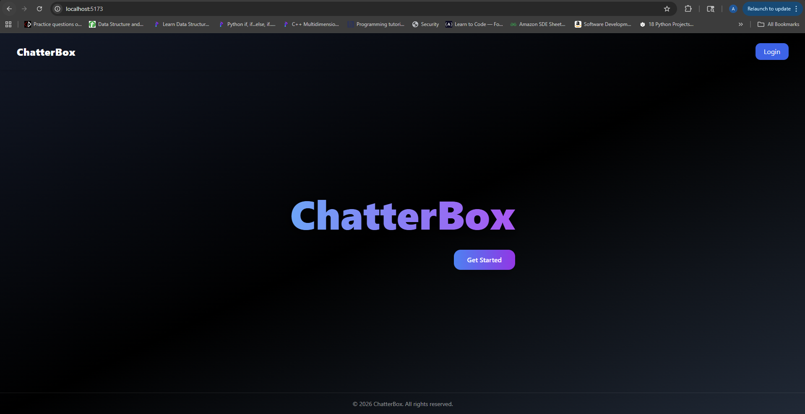
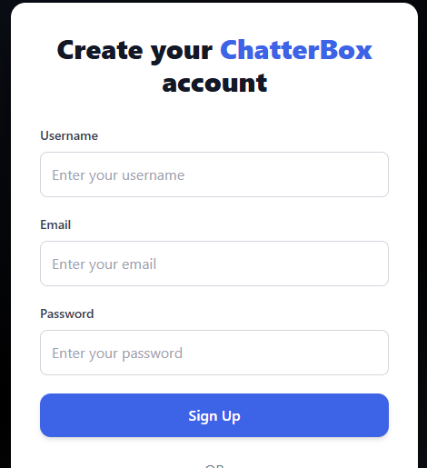
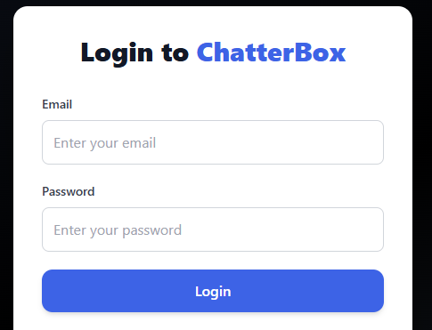
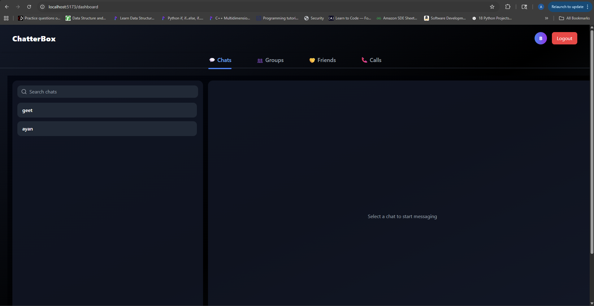
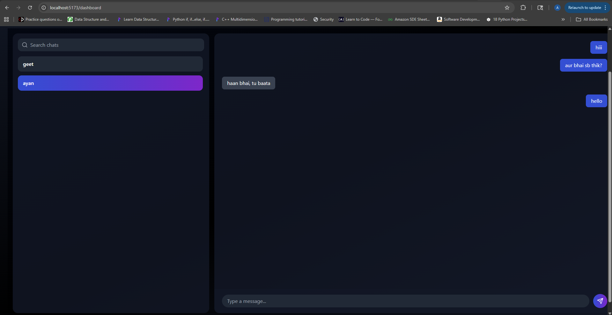
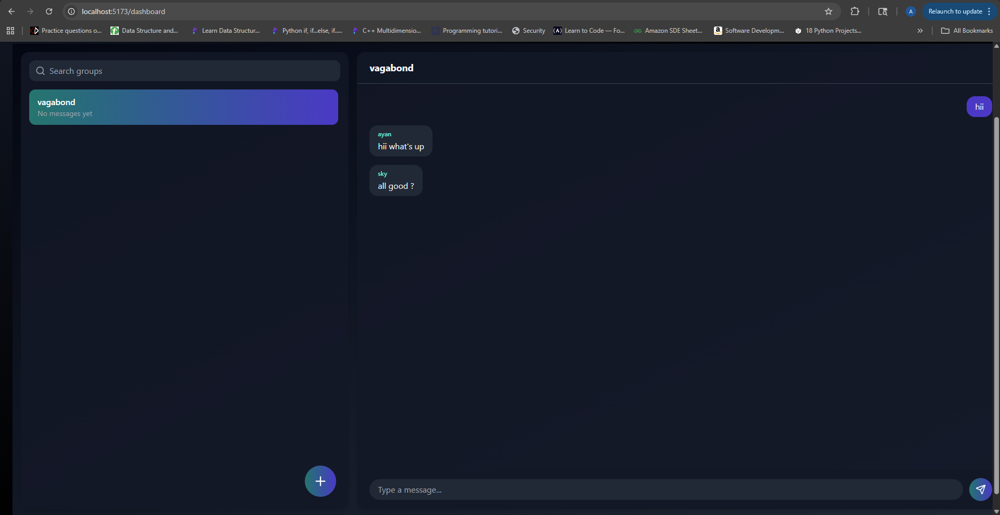
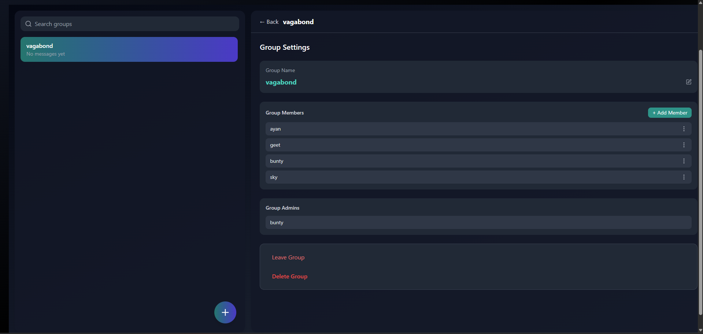
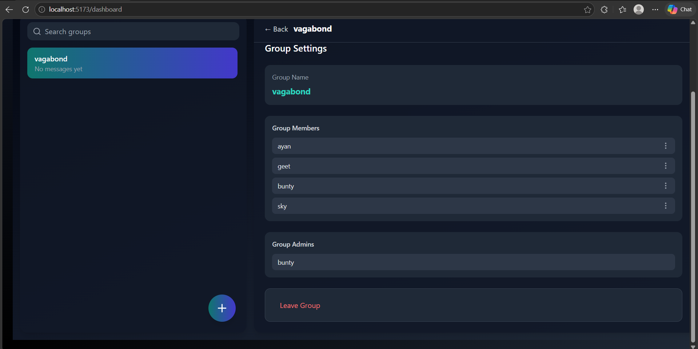
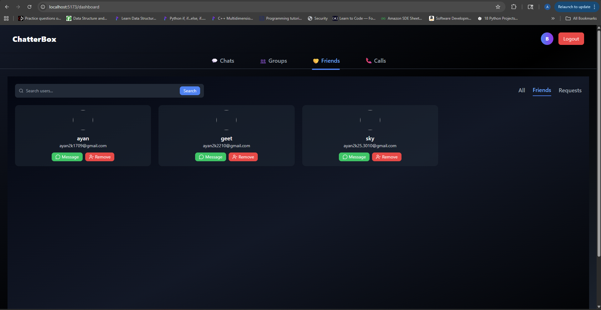

# 💬 Real-Time Chat Application


A full-stack real-time messaging platform supporting private and group communication with secure authentication and live updates.

---

##  Overview

This project simulates modern messaging platforms by enabling real-time communication between users.

It includes private chats, group conversations, and a friend request system, built using a scalable full-stack architecture with React and Spring Boot.

---

##  Features

-  User Authentication (Login / Signup using JWT)
-  Friend Request System
-  One-to-One Private Chat
-  Group Creation & Group Chat
-  Real-Time Messaging using WebSockets
-  Persistent Chat Storage with MongoDB

---

## 📸 Screenshots

### 🏠 Landing Page
Entry point of the application with navigation to authentication and core features.



---

### 📝 Signup Page
User registration interface with secure account creation.



---

### 🔐 Login Page
JWT-based authentication for secure user login.



---

### 📊 Dashboard
Central hub showing chats, friends, and user interactions.



---

### 💬 Private Chat
One-to-one real-time messaging using WebSockets.



---

### 👨‍👩‍👧‍👦 Group Chat
Group messaging interface supporting multiple participants.



---

### 🛠️ Group Details (Admin View)
Admin controls for managing group members and settings.



---

### 👤 Group Details (User View)
Standard user view with limited permissions in group.



---

### 🤝 Friends Page
Manage friend requests and connections within the platform.



##  Tech Stack

### Frontend
- React  
- Tailwind CSS  

### Backend
- Spring Boot  
- Spring Security  
- JWT Authentication  
- WebSockets (STOMP)  

### Database
- MongoDB  

### Additional
- Redis (used for email handling / temporary data)

---

##  System Architecture

- **React Frontend** communicates with backend APIs and WebSocket endpoints  
- **Spring Boot Backend** handles authentication, chat logic, and messaging  
- **WebSockets (STOMP)** enable real-time message delivery  
- **MongoDB** stores users, chats, and messages  
- **Redis** is used for handling temporary data such as email flows  

###  Flow

1. User logs in / signs up  
2. Sends friend request → accepted by another user  
3. Chat session created (private/group)  
4. Messages are sent via WebSocket  
5. Messages are stored in MongoDB and delivered in real time  

---

##  API Endpoints (Sample)

### Authentication
- POST /public/register-user
- POST /public/api/login  

### Friend System
- POST /friends/send-request/{receiverId}  
- POST /friends/accept-request/{senderId}

### Chat
- POST /chat/get-or-create-chat  
- GET /chat/chat-list

---

##  Project Structure

chat-application/
│  
├── frontend/        # React application  
├── backend/         # Spring Boot application  
├── docs/            # Screenshots  
└── README.md  

---

##  Project Status

This project is currently under active development.

Upcoming improvements include:
- Enhanced UI/UX
- Message delivery status (seen/delivered)
- Media sharing (images/files)
- Notification system
- Deployment with Docker & AWS

##  Local Setup

### Clone Repository
```bash
git clone - 
https://github.com/ayan-pakhira/chatterbox.git
cd backend
mvn spring-boot:run

cd frontend
npm install
npm run dev
